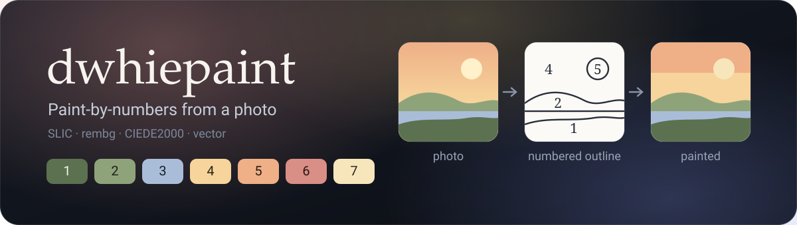
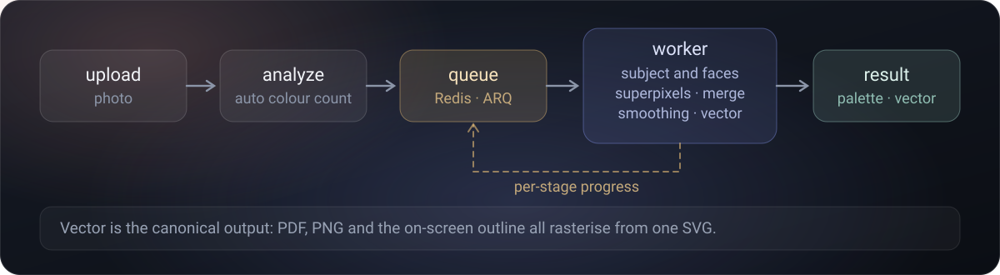

<div align="center">



[Русский](README.md) · **English**

Upload a photo — get a print-ready paint-by-numbers page: a clean outline with
numbered regions, a preview of the finished (painted) result, and a
"number → colour" legend with colour names and a real-paint suggestion.

[](https://dotnet.microsoft.com/)
[](https://react.dev/)
[](https://www.python.org/)
[](https://fastapi.tiangolo.com/)
[](https://www.postgresql.org/)
[](https://redis.io/)
[](https://docs.docker.com/compose/)

</div>

---

## What is this?

**dwhiepaint** is a web app that turns an ordinary photo into a proper
paint-by-numbers page. Unlike naïve online generators, its segmentation is
edge-aware and subject-aware: the main subject stays detailed while the
background collapses into large, genuinely paintable regions.

Heavy processing — including the ML model that separates subject from
background — runs asynchronously, with real-time per-stage progress, so large
photos don't hit a request timeout. You can explore the result in an interactive
viewer and export it to PDF, PNG, SVG or ZIP — right down to printing a large
canvas tiled across A4 sheets.

## Key features

| Feature | Description |
|---|---|
| **Edge-aware segmentation** | SLIC superpixels + an area-weighted Lab palette. Region boundaries follow real edges, not colour noise |
| **Subject understanding (ML)** | `rembg` (u2net) separates subject from background; a face detector and an edge map build an "importance map": eyes, text and fine detail are preserved, flat background is simplified |
| **Automatic colour count** | The algorithm suggests a colour count; fine-tune it with a slider and detail presets (Beginner / Standard / Detailed) |
| **Interactive viewer** | Zoom/pan, layer switching (original ↔ painted ↔ outline), highlight every region of a selected colour |
| **Export formats** | PDF (coloring page with reference thumbnails + legend), PNG, scalable SVG, ZIP bundle with everything at once |
| **Large-canvas printing** | An N×N tiling of A4 sheets with crop marks, overlap and an assembly map page |
| **Real-paint matching** | For each colour, the nearest acrylic paint by CIEDE2000; if there's no exact match, a "mix A + B" suggestion |
| **Asynchronous processing** | Redis task queue + worker; per-stage progress in the UI, nothing blocks the request |
| **Accounts and sharing** | JWT auth, work history, public links to finished pages |
| **Glass interface** | Apple-like glassmorphism, light and dark themes, responsive |

## Examples

A few photos and what comes out of them: a print-ready numbered outline and a
preview of the painted result. Colour count and detail level are tuned per image.

| Original | Paint-by-numbers | Painted preview |
|:---:|:---:|:---:|
| <br><sub>20 colours · Detailed</sub> |  |  |
| <br><sub>24 colours · Detailed</sub> |  |  |
| <br><sub>20 colours · Detailed</sub> |  |  |
| <br><sub>16 colours · Detailed</sub> |  |  |
| <br><sub>17 colours · Detailed</sub> |  |  |
| <br><sub>12 colours · Detailed</sub> |  |  |

## Architecture

```
┌──────────┐   HTTP    ┌──────────────┐   HTTP    ┌──────────────┐
│ frontend │──────────▶│ backend-api  │──────────▶│  cv-service  │
│ (React)  │◀──────────│  (.NET 10)   │           │  (FastAPI)   │
└──────────┘   JSON    └──────┬───────┘           └──────┬───────┘
                              │                    enqueue │  shared
                        ┌─────┴─────┐              ┌───────┴──────┐  volume
                        │ PostgreSQL│              │    Redis     │───────┐
                        └───────────┘              └───────┬──────┘       │
                                                           │              ▼
                                                    ┌──────┴──────┐  ┌─────────┐
                                                    │   worker    │  │  cache  │
                                                    │  (ARQ, Py)  │  │ (files) │
                                                    └─────────────┘  └─────────┘
```

The frontend talks only to `backend-api`, which proxies requests to the CV
service. Heavy segmentation is enqueued by `backend-api`; the worker (the same
codebase as `cv-service`) pulls it from Redis, runs the pipeline, writes progress
back to Redis and drops artifacts into a shared volume that `cv-service` serves.

**Data separation:** `cv-service` has no database access — only an ephemeral
cache keyed by `image_id`. Job progress lives in Redis (ephemeral); final results
are persisted by `backend-api` in Postgres.

### Services

| Service | Stack | Description |
|---|---|---|
| **frontend** | React 19, TypeScript, Vite, react-zoom-pan-pinch | SPA: upload, editor, history, account |
| **backend-api** | ASP.NET Core (.NET 10), EF Core, Npgsql, JWT | Auth, job orchestration, persistence |
| **cv-service** | Python 3.12, FastAPI, OpenCV, scikit-image, rembg | Analysis, segmentation, vectorization, export |
| **worker** | same image as cv-service, ARQ command | Asynchronous processing of queued jobs |
| **redis** | Redis 7 | Task queue + ephemeral progress |
| **postgres** | PostgreSQL 16 | Users, works, palettes |

### Processing pipeline




The canonical pipeline output is a **vector (SVG)**: both the on-screen outline
and the printable PDF/PNG are rasterized from it at the required resolution, so
lines stay clean at any scale. Each number is placed at the region's "pole of
inaccessibility" (`shapely.polylabel`), so the digit always lands inside — even
for concave shapes.

## Quick start

### Run with Docker (recommended)

```bash
git clone https://github.com/darkwhitezero/dwhiepaint.git
cd dwhiepaint

cp .env.example .env          # optionally tweak the DB password and JWT secret
docker compose up --build -d
```

The first `cv-service` build is slow: ML dependencies are installed into the
image and the u2net model (~176 MB) is preloaded so it isn't fetched at runtime.

| Service | URL |
|---|---|
| frontend | http://localhost:5173 |
| backend-api | http://localhost:5000 |
| cv-service | internal, port 8001 |
| postgres | localhost:5432 |

Health checks:

```bash
curl http://localhost:5000/health
curl http://localhost:5000/health/db
```

> Changing code in `cv-service`? Rebuild **and** recreate both services that use
> that image: `docker compose up -d --build cv-service worker`.

### Local development (without Docker)

```bash
# frontend — Vite dev server on http://localhost:5173
cd frontend && npm install && npm run dev

# backend-api — needs Postgres on 5432; migrations run on startup
dotnet run --project backend-api/DwhiePaint.Api

# cv-service — the queue needs Redis; synchronous /analyze and /export
# work without it
cd cv-service && pip install -r requirements.txt && uvicorn app.main:app --port 8001
```

The frontend reads the backend address from `VITE_API_BASE_URL` (defaults to `http://localhost:5000`).

## Repository layout

```
dwhiepaint/
├── docker-compose.yml          # Orchestration of all services
├── .env.example
├── frontend/                   # React 19 + TypeScript + Vite
│   └── src/
│       ├── Editor.tsx          # upload → job → progress → result
│       ├── ResultViewer.tsx    # zoom/pan, layers, inline SVG with highlight
│       ├── PalettePanel.tsx    # palette + region highlight per colour
│       ├── History / Account / AuthScreen / SharedView
│       ├── api.ts              # HTTP layer and types
│       └── index.css, App.css  # theme tokens, glass, aurora
├── backend-api/                # ASP.NET Core (.NET 10)
│   └── DwhiePaint.Api/
│       ├── Endpoints/          # Painting + Auth endpoints
│       ├── Domain/             # User, Image, Painting, PaletteColor
│       ├── Data/               # EF Core DbContext + colour-dictionary seed
│       ├── Services/           # CvClient (proxy to CV), FileStorage
│       └── Migrations/
├── cv-service/                 # Python 3.12 + FastAPI
│   ├── app/                    # analyze, segment, superpixels, matte, faces,
│   │                           # importance, vectorize, numbering, render,
│   │                           # export, jobs, worker
│   ├── data/                   # colors.json (1017 names), paints_acrylic.json (24)
│   └── tests/                  # pytest
└── (worker and redis — services in docker-compose.yml)
```

## API

The frontend calls only `backend-api`. Data/JSON endpoints require a JWT
(`Authorization: Bearer <token>`); image byte endpoints are served anonymously by
a non-public UUID so `` tags can load them.

### Auth

| Method | Path | Description |
|---|---|---|
| POST | `/api/auth/register` | Register, returns a JWT |
| POST | `/api/auth/login` | Log in, returns a JWT |
| GET | `/api/auth/me` | Current user |

### Paintings

| Method | Path | Description |
|---|---|---|
| POST | `/api/paintings` | Upload a photo → analysis (auto-k) |
| GET | `/api/paintings` | The user's works |
| GET | `/api/paintings/:id` | One work + palette |
| POST | `/api/paintings/:id/segment` | Enqueue a segmentation job |
| GET | `/api/paintings/:id/segment` | Status/progress, and the result when done |
| GET | `/api/paintings/:id/export` | Export (`?format=pdf\|png\|svg\|zip&pageSize&tiles`) |
| GET | `/api/paintings/:id/result` | Download the latest export |
| POST/DELETE | `/api/paintings/:id/share` | Create / revoke a public link |

### Anonymous

| Method | Path | Description |
|---|---|---|
| GET | `/api/paintings/:id/original` | The source photo |
| GET | `/api/cv-cache/:id/:file` | Render artifacts (outline, preview, SVG) |
| GET | `/api/shared/:token` | Public page by link |
| GET | `/api/shared/:token/result` | Download via public link |

## Domain

- **Painting** — the result of processing one image: a region map, a palette and
  a set of exports.
- **Palette** — a list of colours (number, hex, Lab, name) + the nearest real
  paint and a mixing suggestion.
- **Segmentation** — splitting the image into large single-colour regions: SLIC →
  k-means palette → small-region merging → label-map smoothing → contours.
- **Importance map** — where to keep detail: subject mask (rembg) + edge
  saliency + faces. It modulates the minimum paintable region size.
- **Job** — a unit of asynchronous processing in the Redis queue, with a status
  and per-stage progress.

## Tech stack

| Component | Technologies |
|---|---|
| Frontend | React 19, TypeScript, Vite, react-zoom-pan-pinch, lucide-react |
| Backend | ASP.NET Core (.NET 10), EF Core, Npgsql, JWT |
| CV / ML | Python 3.12, FastAPI, OpenCV, scikit-image, scikit-learn, rembg (u2net) + onnxruntime, shapely, svgwrite, cairosvg |
| Queue | ARQ (async Redis queue) |
| Database | PostgreSQL 16 |
| Infrastructure | Docker Compose, Redis 7 |

## Environment variables

### .env (root)

| Variable | Default | Description |
|---|---|---|
| `POSTGRES_PASSWORD` | `dwhiepaint` | Database password |
| `JWT_SECRET` | dev string | A long random string for signing JWTs (change it in production) |

### backend-api

| Variable | Description |
|---|---|
| `ConnectionStrings__Default` | PostgreSQL connection string |
| `CvService__BaseUrl` | cv-service address (in compose: `http://cv-service:8001`) |
| `Cors__Origin` | Allowed frontend origin |
| `Jwt__Secret` | JWT secret |

### cv-service / worker

| Variable | Default | Description |
|---|---|---|
| `REDIS_URL` | `redis://localhost:6379` | Redis address for the queue |
| `CACHE_DIR` | `/data/cache` | Shared volume with artifacts |
| `MAX_SIDE` | `2000` | Maximum side of the working image (px) |
| `SUBJECT_AWARE` | `1` | Enables ML detailing (subject/faces/edges) |
| `REMBG_MODEL` | `u2net` | Subject-matting model |

## Known simplifications

- **The paint set is generic** (24 colours), not tied to a specific brand — swap
  it out via `cv-service/data/paints_acrylic.json`.
- **Image links** are served by a non-public UUID rather than signed URLs —
  hardened access is left for later.

---

<div align="center">

Made by **darkwhitezero** · paint-by-numbers from a photo

</div>
