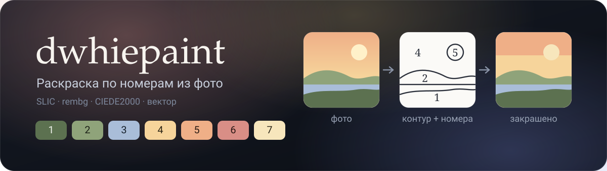
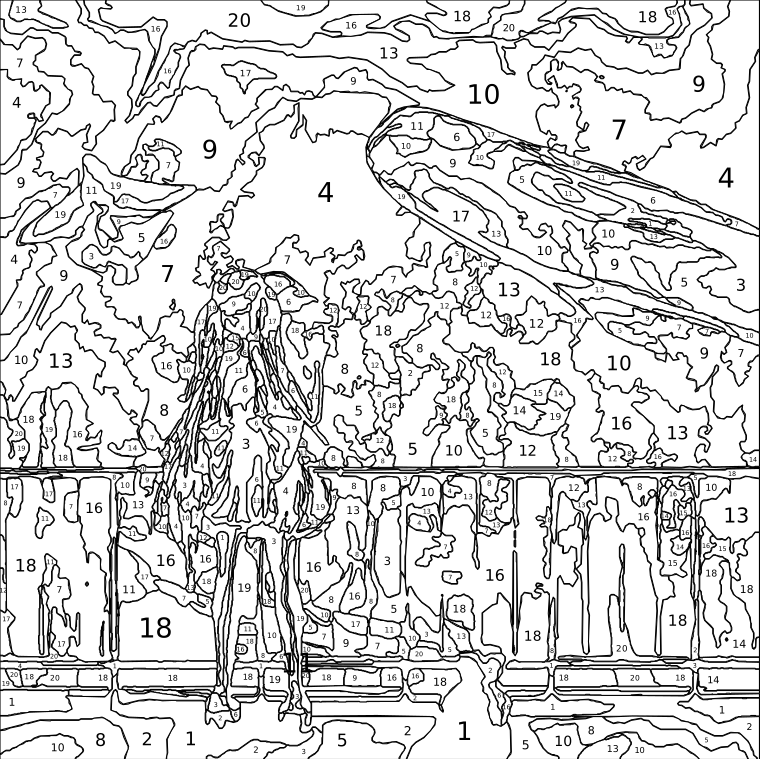
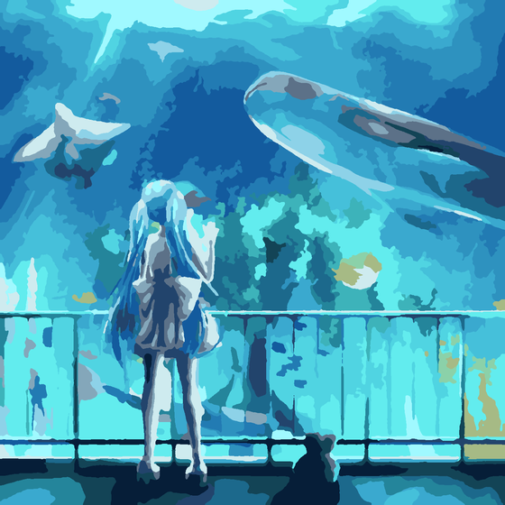
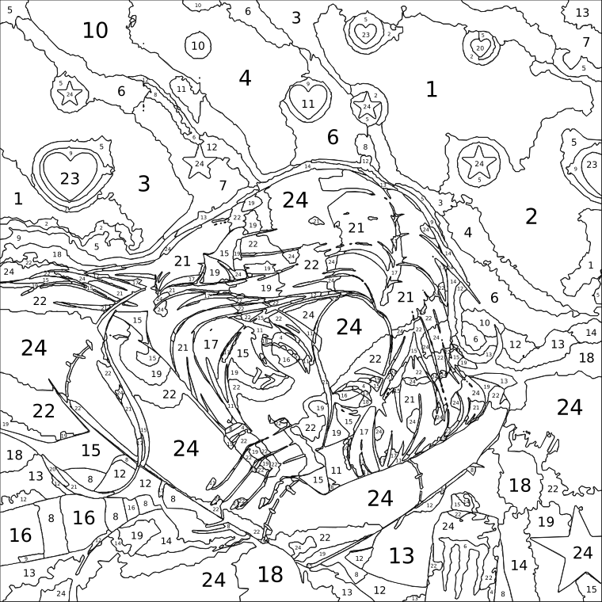
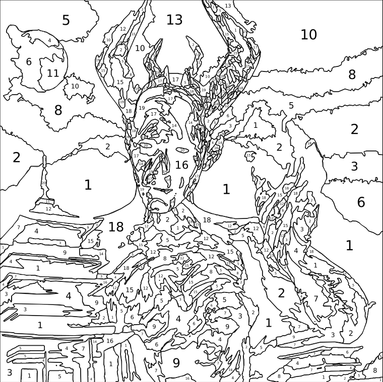
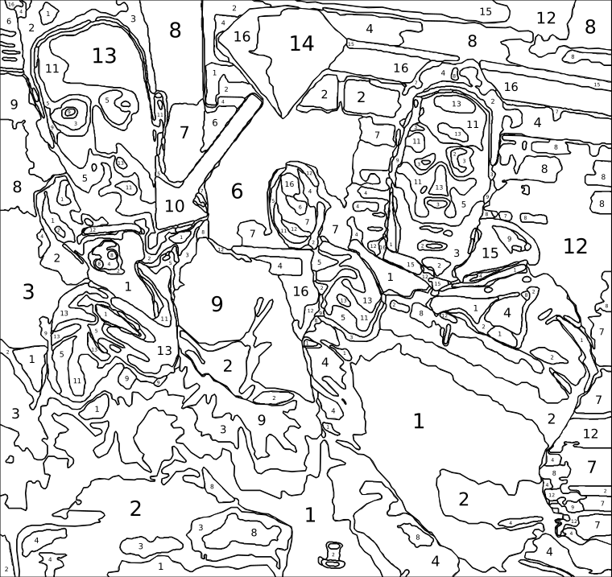
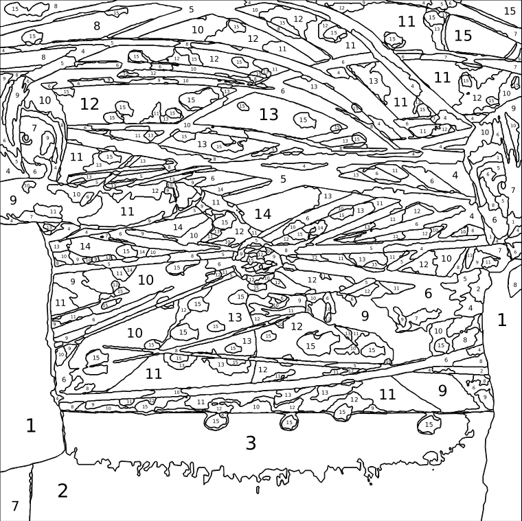
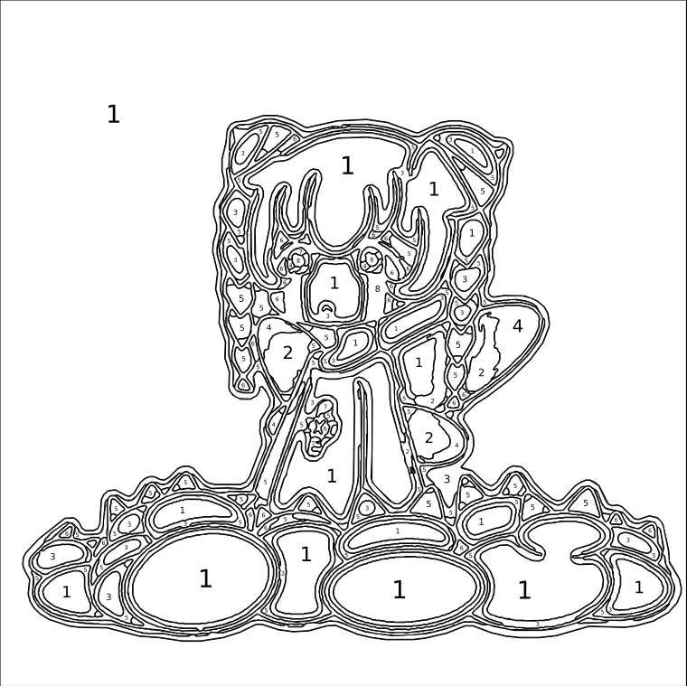
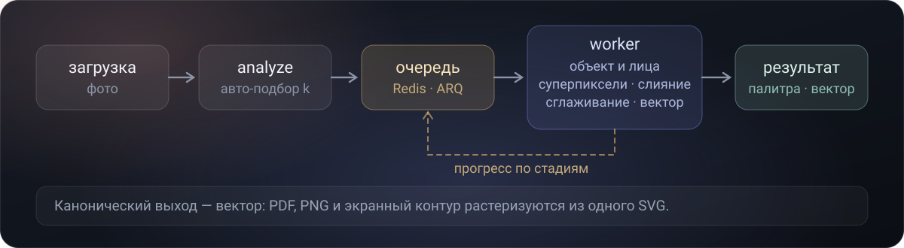

<div align="center">



**Русский** · [English](README.en.md)

Загрузи фотографию — получи готовую к печати раскраску по номерам:
чистый контур с пронумерованными областями, предпросмотр закрашенного результата
и легенду «номер → цвет» с русскими названиями и подсказкой по краскам.

[](https://dotnet.microsoft.com/)
[](https://react.dev/)
[](https://www.python.org/)
[](https://fastapi.tiangolo.com/)
[](https://www.postgresql.org/)
[](https://redis.io/)
[](https://docs.docker.com/compose/)

</div>

---

## Что это?

**dwhiepaint** — веб-приложение, которое превращает обычное фото в полноценную
раскраску по номерам. В отличие от «наивных» онлайн-генераторов, сегментация
здесь edge-aware и понимает сюжет: главный объект остаётся детальным, а фон
упрощается в крупные, реально закрашиваемые области.

Тяжёлую обработку (в том числе ML-модель отделения объекта от фона) приложение
считает асинхронно — с прогрессом по стадиям в реальном времени, так что большие
фото не упираются в таймаут. Результат можно рассмотреть в интерактивном
просмотрщике и выгрузить в PDF, PNG, SVG или ZIP — вплоть до печати большого
холста плиткой из листов A4.

## Ключевые возможности

| Возможность | Описание |
|---|---|
| **Edge-aware сегментация** | SLIC-суперпиксели + палитра по средним Lab с весом по площади. Границы областей идут по реальным краям, а не по цветовому шуму |
| **Понимание сюжета (ML)** | `rembg` (u2net) отделяет объект от фона, детектор лиц и карта краёв строят «карту важности»: глаза, текст, мелкие детали сохраняются, плоский фон упрощается |
| **Автоподбор числа цветов** | Алгоритм сам предлагает количество цветов; можно донастроить ползунком и пресетами детализации (Новичок / Стандарт / Детально) |
| **Интерактивный просмотрщик** | Зум/пан, переключение слоёв (оригинал ↔ закрашено ↔ контур), подсветка всех областей выбранного цвета |
| **Форматы экспорта** | PDF (лист-раскраска с миниатюрами-ориентирами + легенда), PNG, масштабируемый SVG, ZIP-пакет со всем сразу |
| **Печать больших холстов** | Плитка N×N листов A4 с метками реза, перекрытием и страницей-схемой сборки |
| **Подбор реальных красок** | Для каждого цвета — ближайшая акриловая краска по CIEDE2000, а если точной нет, подсказка «смешать A + B» |
| **Асинхронная обработка** | Очередь задач на Redis + воркер; прогресс по стадиям в UI, ничего не блокирует запрос |
| **Аккаунты и шеринг** | JWT-авторизация, история работ, публичные ссылки на готовые раскраски |
| **Стеклянный интерфейс** | Apple-подобный glassmorphism, светлая и тёмная темы, адаптив |

## Примеры

Несколько фотографий и то, что из них получается: нумерованный контур для печати
и предпросмотр закрашенного результата. Число цветов и уровень детализации
подобраны под каждую картинку.

| Оригинал | Раскраска по номерам | Закрашенный предпросмотр |
|:---:|:---:|:---:|
| <br><sub>20 цветов · Детально</sub> |  |  |
| <br><sub>24 цвета · Детально</sub> |  |  |
| <br><sub>20 цветов · Детально</sub> |  |  |
| <br><sub>16 цветов · Детально</sub> |  |  |
| <br><sub>17 цветов · Детально</sub> |  |  |
| <br><sub>12 цветов · Детально</sub> |  |  |

## Архитектура

```
┌──────────┐   HTTP    ┌──────────────┐   HTTP    ┌──────────────┐
│ frontend │──────────▶│ backend-api  │──────────▶│  cv-service  │
│ (React)  │◀──────────│  (.NET 10)   │           │  (FastAPI)   │
└──────────┘   JSON    └──────┬───────┘           └──────┬───────┘
                              │                    enqueue │  общий
                        ┌─────┴─────┐              ┌───────┴──────┐  том
                        │ PostgreSQL│              │    Redis     │───────┐
                        └───────────┘              └───────┬──────┘       │
                                                           │              ▼
                                                    ┌──────┴──────┐  ┌─────────┐
                                                    │   worker    │  │  cache  │
                                                    │  (ARQ, Py)  │  │ (файлы) │
                                                    └─────────────┘  └─────────┘
```

Фронт общается только с `backend-api`, который проксирует запросы к CV-сервису.
Тяжёлую сегментацию `backend-api` ставит в очередь; воркер (та же кодовая база,
что и `cv-service`) забирает её из Redis, гоняет пайплайн, пишет прогресс обратно
в Redis и складывает артефакты в общий том, откуда их отдаёт `cv-service`.

**Разделение данных:** `cv-service` не имеет доступа к БД — только эфемерный
кэш по `image_id`. Прогресс задач живёт в Redis (эфемерно), финальные результаты
сохраняет `backend-api` в Postgres.

### Сервисы

| Сервис | Стек | Описание |
|---|---|---|
| **frontend** | React 19, TypeScript, Vite, react-zoom-pan-pinch | SPA: загрузка, редактор, история, кабинет |
| **backend-api** | ASP.NET Core (.NET 10), EF Core, Npgsql, JWT | Авторизация, оркестрация задач, персистентность |
| **cv-service** | Python 3.12, FastAPI, OpenCV, scikit-image, rembg | Анализ, сегментация, векторизация, экспорт |
| **worker** | тот же образ, что cv-service, команда ARQ | Асинхронная обработка задач из очереди |
| **redis** | Redis 7 | Очередь задач + эфемерный прогресс |
| **postgres** | PostgreSQL 16 | Пользователи, работы, палитры |

### Конвейер обработки




Канонический выход пайплайна — **вектор (SVG)**: из него растеризуются и экранный
контур, и печатный PDF/PNG в нужном разрешении, поэтому линии остаются чистыми на
любом масштабе. Номер ставится в «полюс недоступности» области
(`shapely.polylabel`), так что цифра всегда попадает внутрь даже у вогнутых фигур.

## Быстрый старт

### Запуск через Docker (рекомендуется)

```bash
git clone https://github.com/darkwhitezero/dwhiepaint.git
cd dwhiepaint

cp .env.example .env          # при желании поправьте пароль БД и JWT-секрет
docker compose up --build -d
```

Первая сборка `cv-service` небыстрая: в образ ставятся ML-зависимости и
предзагружается модель u2net (~176 МБ), чтобы не тянуть её в рантайме.

| Сервис | URL |
|---|---|
| frontend | http://localhost:5173 |
| backend-api | http://localhost:5000 |
| cv-service | внутренний, порт 8001 |
| postgres | localhost:5432 |

Проверка здоровья:

```bash
curl http://localhost:5000/health
curl http://localhost:5000/health/db
```

> Меняете код в `cv-service`? Пересоберите **и** пересоздайте оба сервиса,
> которые используют этот образ: `docker compose up -d --build cv-service worker`.

### Локальная разработка (без Docker)

```bash
# frontend — Vite dev server на http://localhost:5173
cd frontend && npm install && npm run dev

# backend-api — нужен Postgres на 5432; миграции применяются на старте
dotnet run --project backend-api/DwhiePaint.Api

# cv-service — для очереди нужен Redis; синхронные /analyze и /export
# работают и без него
cd cv-service && pip install -r requirements.txt && uvicorn app.main:app --port 8001
```

Адрес backend фронт берёт из `VITE_API_BASE_URL` (по умолчанию `http://localhost:5000`).

## Структура репозитория

```
dwhiepaint/
├── docker-compose.yml          # Оркестрация всех сервисов
├── .env.example
├── frontend/                   # React 19 + TypeScript + Vite
│   └── src/
│       ├── Editor.tsx          # загрузка → задача → прогресс → результат
│       ├── ResultViewer.tsx    # зум/пан, слои, инлайн-SVG с подсветкой
│       ├── PalettePanel.tsx    # палитра + подсветка областей цвета
│       ├── History / Account / AuthScreen / SharedView
│       ├── api.ts              # HTTP-слой и типы
│       └── index.css, App.css  # токены темы, стекло, aurora
├── backend-api/                # ASP.NET Core (.NET 10)
│   └── DwhiePaint.Api/
│       ├── Endpoints/          # Painting + Auth эндпоинты
│       ├── Domain/             # User, Image, Painting, PaletteColor
│       ├── Data/               # EF Core DbContext + сидинг словаря цветов
│       ├── Services/           # CvClient (прокси к CV), FileStorage
│       └── Migrations/
├── cv-service/                 # Python 3.12 + FastAPI
│   ├── app/                    # analyze, segment, superpixels, matte, faces,
│   │                           # importance, vectorize, numbering, render,
│   │                           # export, jobs, worker
│   ├── data/                   # colors.json (1017 названий), paints_acrylic.json (24)
│   └── tests/                  # pytest
└── (worker и redis — сервисы в docker-compose.yml)
```

## API

Фронт ходит только в `backend-api`. Data/JSON-эндпоинты требуют JWT
(`Authorization: Bearer <token>`); байтовые эндпоинты изображений отдаются
анонимно по непубличному UUID, чтобы их могли грузить теги ``.

### Авторизация

| Метод | Путь | Описание |
|---|---|---|
| POST | `/api/auth/register` | Регистрация, возвращает JWT |
| POST | `/api/auth/login` | Вход, возвращает JWT |
| GET | `/api/auth/me` | Текущий пользователь |

### Раскраски

| Метод | Путь | Описание |
|---|---|---|
| POST | `/api/paintings` | Загрузка фото → анализ (авто-k) |
| GET | `/api/paintings` | Список работ пользователя |
| GET | `/api/paintings/:id` | Одна работа + палитра |
| POST | `/api/paintings/:id/segment` | Поставить задачу сегментации в очередь |
| GET | `/api/paintings/:id/segment` | Статус/прогресс, а по завершении — результат |
| GET | `/api/paintings/:id/export` | Экспорт (`?format=pdf\|png\|svg\|zip&pageSize&tiles`) |
| GET | `/api/paintings/:id/result` | Скачать последний экспорт |
| POST/DELETE | `/api/paintings/:id/share` | Создать / отозвать публичную ссылку |

### Анонимные

| Метод | Путь | Описание |
|---|---|---|
| GET | `/api/paintings/:id/original` | Исходное фото |
| GET | `/api/cv-cache/:id/:file` | Артефакты рендера (контур, превью, SVG) |
| GET | `/api/shared/:token` | Публичная раскраска по ссылке |
| GET | `/api/shared/:token/result` | Скачать по публичной ссылке |

## Доменная область

- **Раскраска (painting)** — результат обработки одного изображения: карта
  областей, палитра и набор экспортов.
- **Палитра** — список цветов (номер, hex, Lab, русское имя) + ближайшая реальная
  краска и подсказка по смешиванию.
- **Сегментация** — разбиение изображения на крупные одноцветные области: SLIC →
  палитра k-means → слияние мелких областей → сглаживание карты меток → контуры.
- **Карта важности** — где сохранять детали: маска объекта (rembg) + заметность
  краёв + лица. Модулирует минимальный размер закрашиваемой области.
- **Задача (job)** — единица асинхронной обработки в очереди Redis со статусом и
  прогрессом по стадиям.

## Технологии

| Компонент | Технологии |
|---|---|
| Фронтенд | React 19, TypeScript, Vite, react-zoom-pan-pinch, lucide-react |
| Бэкенд | ASP.NET Core (.NET 10), EF Core, Npgsql, JWT |
| CV / ML | Python 3.12, FastAPI, OpenCV, scikit-image, scikit-learn, rembg (u2net) + onnxruntime, shapely, svgwrite, cairosvg |
| Очередь | ARQ (async Redis queue) |
| База данных | PostgreSQL 16 |
| Инфраструктура | Docker Compose, Redis 7 |

## Переменные окружения

### .env (корень)

| Переменная | По умолчанию | Описание |
|---|---|---|
| `POSTGRES_PASSWORD` | `dwhiepaint` | Пароль БД |
| `JWT_SECRET` | dev-строка | Длинная случайная строка для подписи JWT (обязательно сменить в проде) |

### backend-api

| Переменная | Описание |
|---|---|
| `ConnectionStrings__Default` | Строка подключения к PostgreSQL |
| `CvService__BaseUrl` | Адрес cv-service (в compose — `http://cv-service:8001`) |
| `Cors__Origin` | Разрешённый origin фронта |
| `Jwt__Secret` | Секрет для JWT |

### cv-service / worker

| Переменная | По умолчанию | Описание |
|---|---|---|
| `REDIS_URL` | `redis://localhost:6379` | Адрес Redis для очереди |
| `CACHE_DIR` | `/data/cache` | Общий том с артефактами |
| `MAX_SIDE` | `2000` | Максимальная сторона рабочего изображения (px) |
| `SUBJECT_AWARE` | `1` | Включает ML-детализацию (объект/лица/края) |
| `REMBG_MODEL` | `u2net` | Модель матирования объекта |

## Известные упрощения

- **Набор красок универсальный** (24 цвета), не привязан к конкретному бренду —
  заменяется файлом `cv-service/data/paints_acrylic.json`.
- **Ссылки на изображения** отдаются по непубличному UUID, а не по подписанным
  URL — усиление доступа оставлено на будущее.

---

<div align="center">

Сделал **darkwhitezero** · раскраска по номерам из фото

</div>